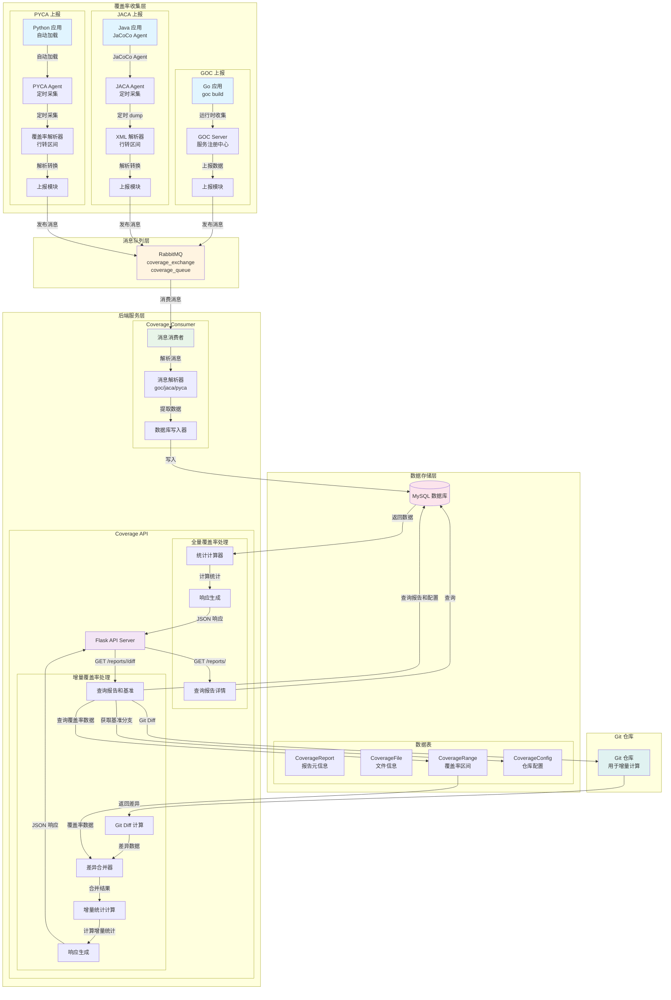
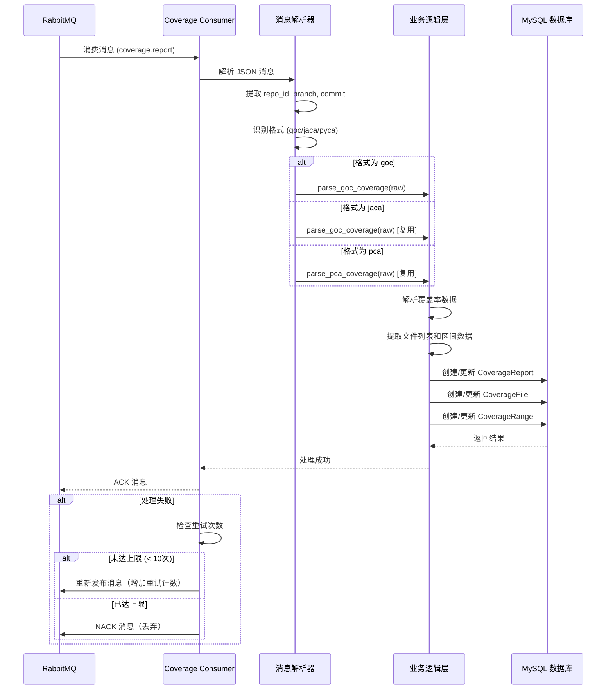
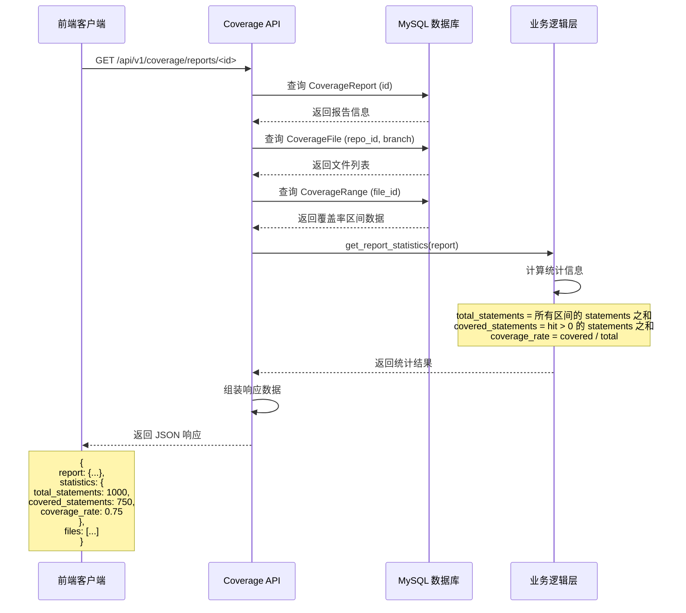
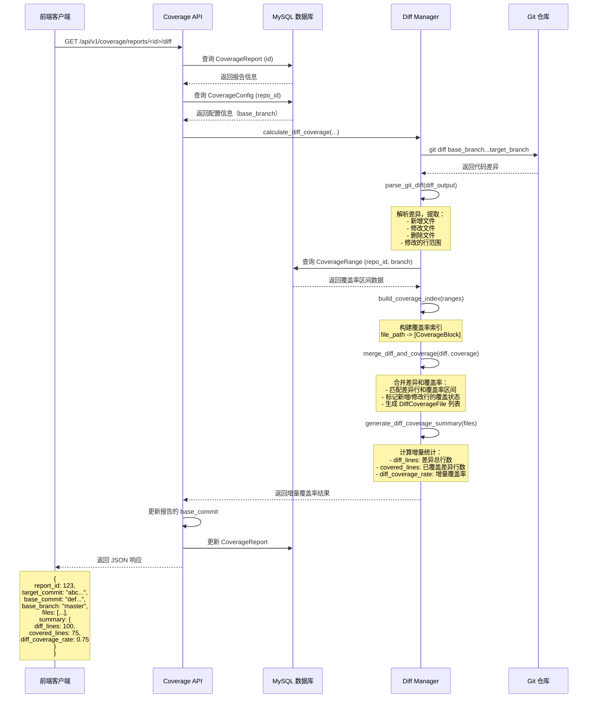

# Orbit 后端服务架构图

## 系统架构概览



## 详细流程说明

### 1. 上报逻辑

#### GOC 上报流程
```
1. Go 应用使用 goc build 构建
2. 应用运行时，goc 自动收集覆盖率数据
3. 通过 goc server 统一管理多个服务
4. 上报模块将覆盖率数据格式化为标准格式
5. 发布消息到 RabbitMQ (routing_key: coverage.report)
```

#### JACA 上报流程
```
1. Java 应用启动时加载 JaCoCo Agent
2. JACA Agent 定时（默认60秒）调用 JaCoCo CLI dump
3. 生成 XML 格式的覆盖率报告
4. XML 解析器将行级覆盖率转换为区间级（兼容 goc 格式）
5. 计算 Fingerprint（SHA256），仅在变化时上报
6. 发布消息到 RabbitMQ (routing_key: coverage.report)
```

#### PYCA 上报流程
```
1. Python 应用启动时自动加载 PYCA（通过 .pth + sitecustomize）
2. PYCA Agent 定时（默认60秒）采集覆盖率数据
3. 提取 executed_lines（已执行行）
4. 将行级数据转换为区间级（连续行合并为区间）
5. 计算 Fingerprint（SHA256），仅在变化时上报
6. 发布消息到 RabbitMQ (routing_key: coverage.report)
```

### 2. 消费者处理核心逻辑



**核心处理步骤**：
1. **消息接收**: 从 RabbitMQ 队列 `coverage_queue` 消费消息
2. **消息解析**: 解析 JSON 格式，提取元信息（repo_id, branch, commit 等）
3. **格式识别**: 根据 `coverage.format` 字段识别格式（goc/jaca/pca）
4. **数据解析**: 调用对应的解析函数，将原始覆盖率数据解析为结构化数据
5. **数据存储**:
   - 创建或更新 `CoverageReport`（报告元信息）
   - 创建或更新 `CoverageFile`（文件信息）
   - 创建或更新 `CoverageRange`（覆盖率区间数据）
6. **错误处理**: 支持重试机制，最多重试 10 次

### 3. API 获取全量覆盖率业务逻辑



**核心处理步骤**：
1. **查询报告**: 根据 report_id 查询 `CoverageReport` 表
2. **查询文件**: 根据 repo_id 和 branch 查询 `CoverageFile` 表
3. **查询区间**: 根据 file_id 查询 `CoverageRange` 表
4. **统计计算**:
   - `total_statements`: 所有区间的 statements 字段之和
   - `covered_statements`: hit > 0 的区间的 statements 之和
   - `coverage_rate`: covered_statements / total_statements
5. **过滤排除**: 根据 `CoverageConfig` 中的 exclude_dirs 和 exclude_files 过滤
6. **响应生成**: 组装 JSON 响应返回给客户端

### 4. API 获取增量覆盖率业务逻辑



**核心处理步骤**：
1. **获取报告和配置**: 查询 `CoverageReport` 和 `CoverageConfig`，获取目标分支和基准分支
2. **Git Diff 计算**: 
   - 克隆或更新 Git 仓库（使用 bare repo + worktree）
   - 执行 `git diff base_branch...target_branch`
   - 解析 diff 输出，提取文件变更和行范围
3. **查询覆盖率数据**: 从数据库查询目标分支的覆盖率区间数据
4. **构建覆盖率索引**: 将覆盖率区间数据组织为高效查找的数据结构
5. **合并差异和覆盖率**:
   - 匹配差异行和覆盖率区间
   - 判断每个差异行的覆盖状态（已覆盖/未覆盖）
   - 生成 `DiffCoverageFile` 列表
6. **计算增量统计**:
   - `diff_lines`: 差异总行数（新增+修改）
   - `covered_lines`: 已覆盖的差异行数
   - `diff_coverage_rate`: covered_lines / diff_lines
7. **更新基准信息**: 更新报告的 `base_commit` 和 `base_branch`
8. **响应生成**: 组装 JSON 响应返回给客户端

## 数据格式说明

### 消息格式（统一）
```json
{
  "repo": "git@github.com:owner/repo.git",
  "repo_id": "12345678",
  "branch": "main",
  "commit": "abc123...",
  "ci": {
    "provider": "github",
    "pipeline_id": "123",
    "job_id": "test"
  },
  "coverage": {
    "format": "goc|jaca|pca",
    "raw": "mode: count\nfile.go:10.32,14.34 2 1\n..."
  },
  "timestamp": 1234567890
}
```

### 覆盖率数据格式（统一区间级格式）
```
mode: count
file.go:10.32,14.34 2 1
file.go:20.10,20.15 1 1
```

格式说明：
- `file.go:startLine.startCol,endLine.endCol statements count`
- `statements`: 该代码块包含的语句数
- `count`: 执行次数（1 表示已覆盖）

## 关键技术点

### 1. 格式统一
- 所有工具（goc/jaca/pyca）最终都转换为区间级格式
- 统一使用 goc 格式作为标准格式
- 便于统一处理和存储

### 2. Fingerprint 算法
- JACA 和 PYCA 使用 SHA256 计算覆盖率指纹
- 仅在覆盖率变化时上报，减少网络传输
- 指纹计算基于区间列表的字符串表示

### 3. 增量覆盖率计算
- 使用 Git Diff 获取代码差异
- 通过区间匹配算法将差异行与覆盖率区间关联
- 支持跨文件、跨模块的增量计算

### 4. 错误处理和重试
- 消费者支持消息重试机制（最多 10 次）
- 使用 RabbitMQ 的 headers 传递重试计数
- 失败消息最终丢弃，避免无限重试

### 5. 数据库设计
- 使用 MySQL 存储结构化数据
- 通过索引优化查询性能（repo_id, branch, file_path 等）
- 支持分页查询和条件过滤

